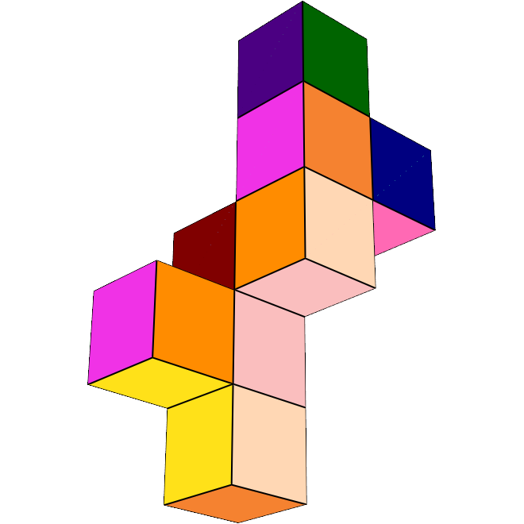

# Enumeration of Ridge Unfoldings of 4-Polytopes

This repository links to the work of students for the Research project course of the CSE bachelor at TU Delft of graduation year 2026.
Please see their projects [here](https://cse3000-research-project.github.io/).

Python implementation for enumerating symmetry-inequivalent ridge unfoldings of selected regular and semiregular 4-polytopes.

Each unfolding is represented as a spanning tree of the polytope's dual graph. Symmetry-equivalent trees are removed using graph automorphisms, and the remaining representatives can be saved, embedded, and visualized in 3D.

## Features

* build dual graph from given 4-polytope data
* enumerate unfoldings up to symmetry
* save unfoldings as `.jsonl` files
* embed and visualize selected unfoldings in 3D

## Example Unfolding of Tesseract



Faces that were shared in the original tesseract were given the same color. 

## Installation

```bash
git clone https://github.com/meeuw64/research-project.git
cd research-project
python -m venv .venv
```

Activate the environment:

```bash
# Windows PowerShell
.\.venv\Scripts\Activate.ps1

# macOS/Linux
source .venv/bin/activate
```

Install dependencies:

```bash
pip install -r requirements.txt
```

## Usage

Run commands from `/src`.

```bash
# Print information about a polytope
python main.py --polytope tesseract --info

# Show available polytope names
python main.py --help

# Enumerate unique unfoldings
python main.py --polytope tesseract

# Save representatives to data/tetrahedral-prism.jsonl
python main.py --polytope tetrahedral-prism --save-trees

# Save representatives to data/my-run.jsonl
python main.py --polytope tetrahedral-prism --save-trees my-run

# Render a saved unfolding with index 84
python main.py --render tesseract.jsonl 84

# General form
python main.py --polytope <POLYTOPE_NAME> [--info] [--save-trees [FILE_NAME]]
```

## Repository structure

```text
research-project/
├── data/                     # Saved .jsonl unfolding catalogues
├── src/
│   ├── polytope_core/         # Polytope data structures and builders
│   ├── unfolding_enumeration/ # Enumeration and symmetry reduction
│   ├── unfolding_plotting/    # 3D embedding and visualization
│   └── main.py                # Command-line entry point
├── README.md
└── requirements.txt
```

## Selected results

| Polytope              | Distinct unfoldings | Runtime |
| --------------------- | ------------------: | ------: |
| 4-simplex / 5-cell    |                   3 | 0.283 s |
| Tesseract / 8-cell    |                 261 | 0.772 s |
| 4-orthoplex / 16-cell |             110,912 |   609 s |
| Rectified 5-cell      |              10,129 |  8.77 s |
| Tetrahedral prism     |                  27 | 0.374 s |
| Octahedral prism      |               9,507 |  11.1 s |

## Notes

This project enumerates ridge unfoldings, not necessarily overlap-free nets. An unfolding is a true net only if the embedded cells do not overlap.

The main computational bottleneck is exhaustive spanning-tree enumeration, so larger 4-polytopes such as the 24-cell, 120-cell, and 600-cell are outside the practical range of the current direct approach.

Additional rendering parameters can be changed in `main.py`

Custom polytopes can be added in `polytope_builder.py`

## Reference

David W. L. Maasdam. *Enumeration of All Non-Equivalent Unfoldings of Selected Regular and Semiregular 4-Polytope Surfaces: A Graph-Theoretic Approach*. CSE3000 Research Project, Delft University of Technology, 2026.
